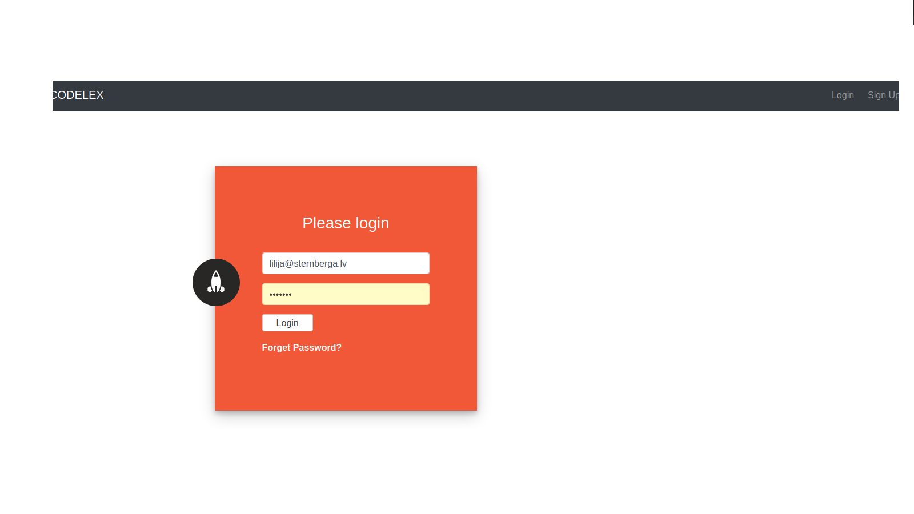

# Simple Registration API



> Registration / login form, where the user can enter an email (as login), name and password.

> Validation on password - at least 6 symbols with at least 1 uppercase letter and a special sign (i.e. !@#$%^&*()_). 

> After sign up - confirmation email “Welcome, 'username'!” is sent.

> With password reset link. The link is valid for 60 minutes. Only the last reset link is working.

> Codebase PHP 7.2.

> For backend/front PHP and JS.

> Database MySQL.

## Installation

### Clone

- Clone this repo to your local machine using `https://github.com/shternberga/Simple-Registration-API.git`

### Setup

> create two database tables:

> user table

```shell
create table user
(
    id         int auto_increment
        primary key,
    name       varchar(30)                        not null,
    email      varchar(50)                        not null,
    password   varchar(100)                       not null,
    created_at datetime default CURRENT_TIMESTAMP not null,
    constraint user_email_uindex
        unique (email)
);
```

> and resets table

```shell
create table resets
(
    id         int auto_increment
        primary key,
    email      varchar(50)                        null,
    hash       varchar(255)                       null,
    created_at datetime default CURRENT_TIMESTAMP null,
    constraint resets_hash_uindex
        unique (hash)
);
```

> add Your database connection variables into config/database.php file

```shell
    private $host = "localhost";
    private $db_name = "yourDB";
    private $username = "yourUserName";
    private $password = "yourPassword";
```
---


> and just type 

```shell
php -S localhost:8000
```
---

## Authors

* **Lilija Sternberga** - [GitHub](https://github.com/shternberga), 
                          [LinkedIn](https://www.linkedin.com/in/lilija-sternberga/)

